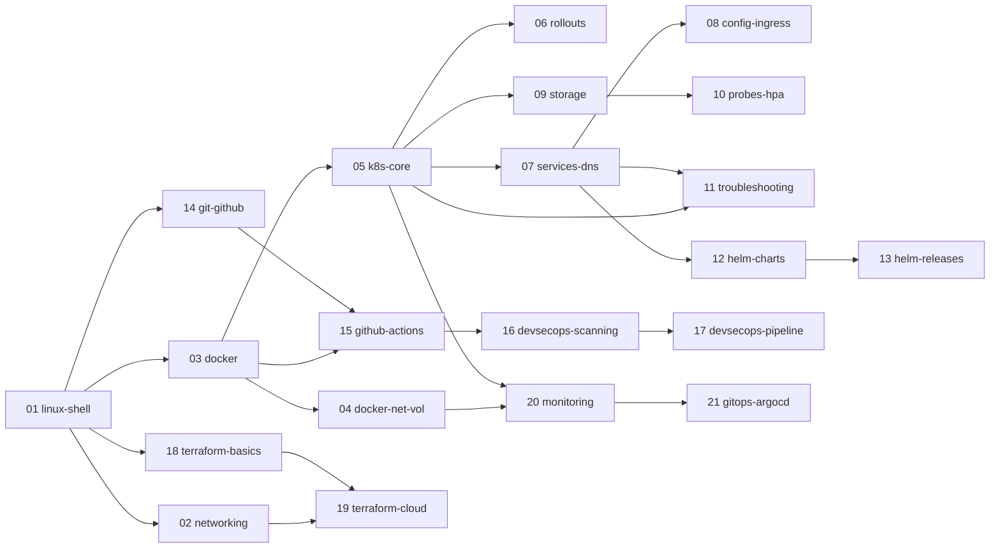

# Roadmap

Source: `course/` @ `fe23e99` (submodule of https://github.com/Nency-Ravaliya/devops-heros, 20 sessions, 447 files, one course commit series ending "session 19 & 20 resources").
Written 2026-09-30. Nothing in this file has been executed against the course material yet; the only commands run were tool version checks and file reads. Claims marked **UNVERIFIED** were not confirmed against an official source.

## 1. Toolchain (this machine)

macOS 27.2, arm64 (Apple silicon).

| Tool | Result | Note |
|---|---|---|
| docker | client 29.7.2 | **Daemon not running** (`dial unix ~/.docker/run/docker.sock: no such file`). Server version unknown. Start Docker Desktop before topic 03. |
| minikube | v1.39.0 | Existing `minikube` profile; kubectl context `minikube` exists but its container is not running. |
| kubectl | client v1.37.1 (kustomize v5.8.1) | |
| helm | **v4.3.0** (go1.27.1) | Course targets Helm 3. `--atomic` no longer exists in `helm upgrade --help` here; `--rollback-on-failure` replaces it. |
| terraform | v1.16.4 darwin_arm64 | Course pins `>= 1.6.0`, aws `~> 6.0`. |
| kind | v0.33.0 | Installed this session (`brew install`). |
| act | v0.2.89 | Installed this session. |
| actionlint | 1.7.12 | Installed this session (pulled in shellcheck). |
| shellcheck | 0.11.0 | Installed this session. |
| mmdc | 12.0.0 | Mermaid CLI, puppeteer chrome present in `~/.cache/puppeteer`. |
| git | 2.54.0 (Apple Git-157) | |
| python3 / node | 3.13.12 / v24.15.0 | Course uses 3.12 (sessions 16–17) and `node:24-alpine` (session 6–7). Use containers, not the host, when versions matter. |
| jq | 1.7.1 | |
| Not installed | trivy, yq, pdftotext | Trivy is not needed on the host (see §5). |

Repo state: `main` has one commit; `.gitmodules` and `course` are staged but uncommitted, `CLAUDE.md`, `.gitignore`, `.claude/`, `learn/` are untracked. `git -C course status` shows `M .DS_Store` (Finder writes it when the folder is opened; not modified by Claude). See risks in §6.

## 2. Ground rules for labs

- Kubernetes: **minikube** for topics 05–13 (the course's own READMEs assume it), **kind** for topics 17, 21 (the course uses kind there).
- minikube + Docker driver on macOS: the node IP is not reachable from the host. minikube docs: "The network is limited if using the Docker driver on Darwin, Windows, or WSL, and the Node IP is not reachable directly." Use `minikube service <svc> --url` (keeps a terminal open) or `minikube tunnel` (needs sudo; you run it). Every `curl $(minikube ip):<nodePort>` in the course therefore fails as written. Source: https://minikube.sigs.k8s.io/docs/handbook/accessing/
- No `/etc/hosts` edits: use `curl --resolve host:port:127.0.0.1` instead (course's `run-demo.sh` does `sudo tee -a /etc/hosts`).
- Terraform: local/random/null providers run for real. Course AWS configs get `init` + `validate` only; **no real AWS, no credentials**. LocalStack is an optional extra path (needs a check at topic time whether the current image requires an account token: **UNVERIFIED**).
- GitHub Actions: `actionlint` + `act`. Course workflows live in lesson subfolders, so each lab copies one into a scratch repo root.
- Every lab has a cleanup step that is actually run. Free NodePorts between labs (30080 is reused, see §4).

## 3. Topics, in order

Default order (Linux, networking, Docker, Kubernetes, Helm, GitHub Actions, Terraform) kept. Changes: Docker split in two; Kubernetes split into seven (session 10, 11, 13 are each too large); DevSecOps split in two; Terraform split in two; monitoring and GitOps split; Git moved to just before Actions because Actions needs it and the course gives it only links.

| # | Slug | `course/` paths | Prerequisites | Lab environment |
|---|---|---|---|---|
| 01 | `01-linux-shell` | `session1-devops-engineer-roadmap/` (handwritten overview PDF), `session2-linux/{basic-linux,ad-linux}.pdf`, `session3-shell-scripting/` | none | `ubuntu` container (GNU tools; the course commands are Linux-only: `systemctl`, `apt`, `/var/log/syslog`, `journalctl`). `shellcheck` on session 3 scripts. macOS bash is 3.2, so run scripts in the container. |
| 02 | `02-networking` | `session4-networking/`, `session2-linux/Linux Networking Cheat Sheet.pdf`, `session3-shell-scripting/asd.md` | 01 | Containers with `--cap-add NET_ADMIN`; `ip`, `ss`, netns/veth, subnet math with `ipcalc`/python `ipaddress`. Course content is theory + external links, so the guide goes well beyond the source. |
| 03 | `03-docker` | `session6-7-docker/` | 01; Docker Desktop running | Docker Desktop. Node/nginx/python images are multi-arch. |
| 04 | `04-docker-networking-volumes` | `session8-docker-networking-volume/` | 03 | Docker Desktop + compose. |
| 05 | `05-k8s-core-objects` | `session9-k8s/`, `session10-k8s-core-objects/{Readme.md,pod*,replicaset*,deployment*,daemonset,k8s-core-objects,hello.yml,service.yml,pod-lifecycle}` | 03 | minikube. `mysql:5.7` in `statefulset.yml` has no arm64 image (**UNVERIFIED**, reported by file read only), swap and document. |
| 06 | `06-k8s-rollouts` | `session10-k8s-core-objects/{01-rolling-update,02-blue-green,03-canary,04-recreate,troubleshooting}` | 05 | minikube, `minikube service --url`. |
| 07 | `07-k8s-services-dns` | `session-11-kubernetes-services/` | 05 | minikube; LoadBalancer needs `minikube tunnel` (you run it). ExternalName lab needs internet. |
| 08 | `08-k8s-config-secrets-ingress` | `session-12-ingress-configmaps-secrets/` | 07 | minikube `ingress` addon (ingress-nginx, retired, see §5), tunnel + `curl --resolve`. |
| 09 | `09-k8s-storage` | `session-13-storage-hpa-probes/01-volumes`, `02-persistent-storage`, `03-storageclass` | 05 | minikube (hostPath is inside the node, not on the Mac). |
| 10 | `10-k8s-probes-hpa` | `session-13-storage-hpa-probes/{04-hpa,05-probes,hpa,mini-project}` | 09 | minikube `metrics-server` addon. |
| 11 | `11-k8s-troubleshooting` | `session-14-kubernetes-troubleshooting/` | 05, 07 | minikube. |
| 12 | `12-helm-charts` | `session-15-helm/{01..06}` | 07; Helm concepts | helm v4.3.0 + minikube. Bitnami install replaced by a local chart. Note Helm 3 vs 4 differences. |
| 13 | `13-helm-releases` | `session-15-helm/{07,08,09,mini-project}` | 12 | Same. `--atomic` becomes `--rollback-on-failure`. |
| 14 | `14-git-github` | `session5-git-github/` (links only) | 01 | Local repos in a scratch dir; a bare repo stands in for the remote. No push to GitHub. |
| 15 | `15-github-actions` | `session-16-github-actions/session-16-github-actions/` | 03, 14 | `actionlint` + `act`. Secrets via `act --secret`, artifacts via `--artifact-server-path`. |
| 16 | `16-devsecops-scanning` | `session-17-devsecops/{04-sast,05-sca,06-secret-scanning,07-container-image-scanning}` | 15 | pip-audit and bandit locally; Trivy via container. CodeQL is GitHub-only: guide only. |
| 17 | `17-devsecops-pipeline` | `session-17-devsecops/{02-container-registry,03-kubernetes-deployment,08-security-gates,demo}` | 16, kind | `act` + kind; a local `registry:2` replaces Docker Hub/GHCR. |
| 18 | `18-terraform-basics` | `session18-terraform-iac/` | 01 | Rewrites with `local`/`random`/`null`/`terraform_data` that run for real (init, plan, apply, state, destroy). Course AWS files: `init` + `validate` only. |
| 19 | `19-terraform-cloud-networking` | `session19-cloud-terraform/` | 02, 18 | Cloud/VPC concepts as text; course VPC config validated only; optional LocalStack. No real AWS. |
| 20 | `20-monitoring-prometheus-grafana` | `session20-monitoring-observability-gitops/{01..04}` | 04, 05 | Docker compose (prom/prometheus:v3.5.0, grafana/grafana:12.1.1) + kind for `02`. |
| 21 | `21-gitops-argocd` | `session20-monitoring-observability-gitops/{05..08}` | 20, kind | kind; Argo CD pinned to a version tag; the Git source is an in-cluster or local git server (no GitHub push). |

## 4. Course inventory and problems found

Paths relative to `course/` @ `fe23e99`. "Broken" means found by reading files, not yet by running them; each is re-checked in its topic.

### session1-devops-engineer-roadmap (light)
`devops1-83.pdf`: 13 handwritten pages (monolith vs microservices, DevOps tool list, lifecycle, job roles). `session1.md` is a heading only.

### session2-linux (light)
Three PDFs (read directly): basic commands, "advance" commands, `ip` cheat sheet (LinuxTrainingAcademy). `session2.md` is empty.
- `ad-linux.pdf` table rows are shifted: `vmstat 1` is described as "Enhanced version of top", `iostat -xz 1` as "memory, CPU, and I/O usage" and so on; `kill 9 1234` in `basic-linux.pdf` is missing the dash (`kill -9`). Use a man page, not the PDF, as truth.
- Everything is Linux-only; on macOS `ip`, `ss`, `systemctl`, `journalctl`, `/proc` do not exist.

### session3-shell-scripting (light)
13 tiny scripts. Bugs (from reading): `function.sh` ends with `show_info()` (syntax error, should be `show_info`); `task.md` uses `echo $hostname` / `$whoami` (unset variables, prints blank); `test1.sh` uses `echo hostname` (prints the word); `condition.sh` compares unquoted, unvalidated input; no shebangs and `mkdir` without `-p`. Committed output: `test/app.log`, `data1/app.log`, `hello/app.log`. `asd.md` is subnetting notes in the wrong session and says `255.255.255.255 - Class D`.

### session4-networking (light)
`ip.md` + `resources.md` (7 links to one author's GitHub repos). Errors: `197.23.45.10 - 255.255.255.0 - 197.23.34.255` (broadcast should end `.45.255`), `Class A: 1 - 127` (127 is loopback), private range list has only `10.0.0.0/8`, `120.27.1.0/8` is not a network address, file ends mid-heading.

### session5-git-github, session9-k8s (very light)
Links only.

### session6-7-docker (medium)
`node-app`, `multi-stage-dockerfile`, `nginx-web`, `python-app`, `docker-compose-app` (nginx+redis), 3 PDFs (5, 5, 51 pages, not read). Images: `node:24-alpine`, express `^5.1.0`, `python:3.11-slim`, `nginx:latest`, `nginx:alpine`, `redis:alpine`.
- `python-app/Dockerfile` cannot build: `COPY requirements.txt .` (file absent) and `apt install -y pip3 python3` (no such apt package; it is `python3-pip`, and the base image already has Python).
- `session6-7-docker/Dockerfile` is empty (0 bytes).
- `multi-stage-dockerfile`: builder stage builds nothing, second stage reinstalls; does not show why multi-stage exists. No lockfile, no `.dockerignore`, all containers run as root, `nginx:latest` unpinned.
- `docker.md` teaches `docker system prune -a` and `rmi -f $(docker images -q)`; destructive on a real machine. In labs, use a dedicated scratch prefix and never run these on the host without asking.

### session8-docker-networking-volume (light-medium)
Three compose files + `demo/` (nginx → Flask → MySQL, two networks, named volume). `mysql:8.0`, `python:3.12-slim`, unpinned Flask and mysql-connector.
- Hardcoded `MYSQL_ROOT_PASSWORD: root` and app connects as root.
- `depends_on` without a healthcheck: first `/api` call races MySQL start.
- `docker-compose-app` uses untagged `mysql` and no volume.
- MySQL 8.0 is past end of life (§5).

### session10-k8s-core-objects (heavy)
Three overlapping sets of core-object manifests, 12 pod-lifecycle cases, four rollout strategies, two troubleshooting cases.
- Duplicates are **not** identical (top-level `pod.yml` is `nginx-pod`; `k8s-core-objects/pod.yml` is `mypod`), so the guide must say which one is used.
- Top-level `pod.yml` and `replicaset.yml` share `app: nginx`; a ReplicaSet adopts a matching bare Pod.
- `k8s-core-objects/deamonset.yml` typo; `statefulset.yml` needs a headless Service that is not provided, a default StorageClass, `mysql:5.7` (amd64 only, EOL), plaintext `MYSQL_ROOT_PASSWORD: "password"`.
- `deployment-v1/v2.yaml` change the label and echoed string, not the image, so the "upgrade" does not change the running software.
- Many untagged images (`nginx:latest`, `busybox`, `prom/node-exporter`).

### session-11-kubernetes-services (heavy)
Five service types plus 38 KB of `fqdn.md`/`service.md`.
- `04-externalname/service.yaml` targets `nencyravaliya.me` but the README uses `api.github.com`; the README's `curl -H "Host: api.github.com" https://external-database-service` fails TLS name verification.
- Orphan folders not referenced by any doc: `deployment/`, `service/`, `dns-test/`, `troubleshooting/`.
- NodePort 30080 used in `02-nodeport`, `service/nodeport.yaml`, session 10 `service.yml`, session 15 guestbook. Delete between labs.

### session-12-ingress-configmaps-secrets (medium-heavy)
- READMEs use paths `configmap/`, `secret/`, `ingress/`; real folders are numbered (`01-configmap/`...).
- `04-full-demo/ingress.yaml` applies `rewrite-target: /$2` to the whole Ingress, rewriting frontend paths too.
- `03-ingress/path-based.yml` references `frontend-service` and `backend-service`, which do not exist.
- `02-secret/azure-pipelines.yml` (82 bytes) is not valid Azure Pipelines YAML and is referenced nowhere.
- `lab.md` lists `README.md` and `instructor-notes.md` that do not exist and says "your cloud instance".
- Secrets are base64-only; the docs correctly say that is not encryption.
- `run-demo.sh` runs `sudo tee -a /etc/hosts`.

### session-13-storage-hpa-probes (heavy)
- `02-persistent-storage/pvc.yaml` has no `storageClassName: ""`; on minikube the default class makes it bind a new dynamic volume instead of `student-pv`, so the README's `Bound student-pv` output will not match.
- `hpa/hpa-backend.yaml` targets `yatri-backend`, which lives in session 11 `deployment/`.
- `mini-project`: 2–5 replicas mounting one ReadWriteOnce PVC works on one node only.
- `04-hpa/demo-chart` is an unmodified `helm create` scaffold (appVersion 1.16.0, so `nginx:1.16.0`), unrelated to the HPA lab; identical copy in session 14.

### session-14-kubernetes-troubleshooting (medium)
- `09-service-dns-troubleshooting/service.yaml` selector `app: web-ahsgdf` is accidental (README steps 4 and 8 expect working endpoints before the intentional break in step 9).
- `02-kubectl-describe` README says `pod.yaml`; file is `demo-pod.yaml`. Top-level README folder names (`08-pending-pod`, `09-service-dns`) do not match.
- `kubectl get endpoints` prints a deprecation warning on current Kubernetes (Endpoints is deprecated; from which version is **UNVERIFIED**, the page fetched did not say).
- `wget` inside the dnsutils image: **UNVERIFIED**, check in lab.

### session-15-helm (medium-heavy)
- `01-what-is-helm` installs from `charts.bitnami.com/bitnami`; see §5, likely fails.
- `05-values-yaml` README uses `.Values.app.name` and `./chart`, but the folder holds a `helm create` scaffold plus loose `values*.yaml` that match no chart.
- `08-rollback` runs `./app-chart`, which exists only in `07-install-upgrade/`.
- `02-helm-charts` README runs `helm create demo-chart`; folder is `myapp`.
- `latest` tags in five `values.yaml` files. The "guestbook" chart is plain nginx.
- Docs use `get-helm-3`/`v3.15.0`; this machine has Helm 4.3.0.

### session-16-github-actions (light-medium)
Nested duplicate directory `session-16-github-actions/session-16-github-actions/`. Actions used: `checkout@v6`, `setup-python@v7`, `upload-artifact@v4`; runner `ubuntu-latest`; Python 3.12.
- Workflows sit under `NN-*/.github/workflows/`; GitHub only reads the repo-root `.github/workflows/`, so none trigger as laid out.
- `app/`, `tests/` are byte-identical in 09, 10 and `demo`.
- `09-build-and-test/README.md` expects `10 + 5 = 15` output, but `calculator.py` is an interactive `input()` loop.
- No `permissions:` blocks; `07-secrets` exits 1 without `DEMO_SECRET`.

### session-17-devsecops (heavy)
Workflow uses `checkout@v4`, `setup-python@v5`, `codeql-action@v3`, `docker/login-action@v3`, `helm/kind-action@v1.10.0`; Trivy installed via apt.
- Pushes to and deploys from a named person's Docker Hub account: `nensiravaliya28/hey-cicd` (workflow and `k8s/deployment.yaml`). READMEs say GHCR and secret `KUBECONFIG`; workflow uses Docker Hub and `DOCKERHUB_TOKEN`.
- `trivy image --severity HIGH,CRITICAL ...` has no `--exit-code 1`, so the "security gate" cannot fail. The image is built three times, so the scanned image is not the pushed one.
- `app.py` runs Flask `debug=True` on `0.0.0.0`; container runs as root; `/api/calculate` `power` allows `a ** b` with unbounded input.
- Committed `demo/.coverage` and six `__pycache__/*.pyc`. File named `.dockerignore  │` (trailing box-drawing character). `citeturn0search0...` text leaked from an AI tool into two READMEs. `SECURITY.md` is the unedited template.
- The `03` README manifests (port 5000, `/health`) differ from `demo/k8s` (port 5001, no probes).

### session18-terraform-iac (medium)
`required_version >= 1.6.0`, `aws ~> 6.0`, region `ap-south-1`; every example creates an `aws_s3_bucket`. `terraform-s3-demo/.terraform.lock.hcl` (aws 6.66.0) is committed.
- `terraform-s3-demo/outputs.tf` has `type = string` inside an `output` block, which is not a valid argument, so `terraform validate` should fail (**UNVERIFIED** until run).
- README names `aws_s3_bucket.demo` and a `terraform.tfvars`; real resource is `yatri1107`, no tfvars. `08-destroy` README says `lifecycle_demo`; real name `destroy_demo`.
- Hardcoded globally-unique bucket name `yatri1107` with `force_destroy = true`.
- No remote backend or locking is taught.

### session19-cloud-terraform (medium)
- All `.gitignore` files exclude `.terraform.lock.hcl`, which HashiCorp recommends committing (session 18 commits it).
- `06` README expects `Plan: 6 to add` then `Apply complete! Resources: 5 added`.
- `07` README says `aws_s3_bucket.demo`; real name `workflow_demo`.
- `01` SaaS example is worded wrongly ("I want to use email. AWS handle the server setup").
- Security groups open 80/443 to `0.0.0.0/0` (acceptable for web ports; `05` warns against SSH from anywhere). `08` largely duplicates `06`.

### session20-monitoring-observability-gitops (heavy)
Images `prom/prometheus:v3.5.0`, `grafana/grafana:12.1.1`, `busybox:1.36`, `nginx:1.27-alpine`.
- Grafana with no admin password set; README says `admin`/`admin`.
- Argo CD installed from unpinned `stable` with plain `kubectl apply`; current docs require `--server-side --force-conflicts` (§5).
- `argocd-application.yaml` lives inside the `app/` path Argo syncs (`07`, `08`), while its own comment says not to; `repoURL` is the placeholder `YOUR_USERNAME/YOUR_GITOPS_REPO`.
- `02` Service targets port 8080 but busybox listens on nothing; nothing exposes `/metrics`, so Prometheus only scrapes itself.

## 5. Claims checked against official sources

| Claim | Result | Source |
|---|---|---|
| ingress-nginx is retired | Best-effort maintenance until March 2026, then no releases, bugfixes or security updates; existing installs keep working; official advice is to migrate to Gateway API. | https://kubernetes.io/blog/2025/11/11/ingress-nginx-retirement/ |
| Helm 4 replaces `--atomic` | Helm 4.3.0 docs list `--rollback-on-failure`; `helm upgrade --help` on this machine has no `--atomic`. | https://helm.sh/docs/helm/helm_upgrade/ and local `helm upgrade --help` |
| `actions/setup-python@v7` exists | README shows `@v7` and a "What's new in V7" section. (Earlier doubt withdrawn.) | https://github.com/actions/setup-python |
| Argo CD needs `--server-side` | Quoted: "required because some Argo CD CRDs (like ApplicationSet) exceed the 262KB annotation size limit imposed by client-side `kubectl apply`". | https://argo-cd.readthedocs.io/en/stable/getting_started/ |
| MySQL 8.0 EOL | Premier support ended 2025-04-30, extended ends 2026-04-30; 8.4 LTS and 9.7 LTS (released 2026-04-21) are current. 5.7 extended support ended 2023-10-31. | https://endoflife.date/mysql (third-party aggregator; confirm at dev.mysql.com) |
| Bitnami free images moved | From 2025-08-28 versioned images moved to `docker.io/bitnamilegacy` with no updates; free tier limited to `latest`. Secondary sources only; not from Bitnami/Broadcom directly. | WebSearch results (Medium, Northflank, Devtron); primary source **UNVERIFIED** |
| minikube docker driver on macOS | Node IP not reachable; use `minikube service --url`. | https://minikube.sigs.k8s.io/docs/handbook/accessing/ |
| Endpoints API deprecated | Yes ("Endpoints (deprecated)"); version of deprecation **UNVERIFIED**. | https://kubernetes.io/docs/concepts/services-networking/service/ |

**Trivy:** the session 17 workflow installs Trivy on the GitHub-hosted runner, so in CI it runs on GitHub's servers. Locally, `act` runs the same job in a container, so nothing is needed on your Mac. For the scanning topic, Trivy runs as a container image. This is why it was not installed.

## 6. Risks and open questions

1. `main` has nothing committed except one initial commit; `.gitmodules`/`course` are staged only. Topic branches cut from `main` will not contain `course/` until you commit it there.
2. `course/.DS_Store` shows as modified. Committing or restoring it is your call; the topic checklist ("`git -C course status` clean") will report it every time until then.
3. Docker Desktop is not running. Topics 03+ need it.
4. Helm is v4.3.0; the course teaches Helm 3. Guides will call out differences; some course commands may differ (e.g. `--atomic`).
5. `ingress-nginx` is retired. The lab still works but is unsupported; Gateway API is the recommended direction and is out of course scope.
6. Argo CD needs a reachable Git repo: plan is an in-cluster/local git server. Alternative is a public GitHub repo, which needs you to push.
7. Session 1 and 2 sources are handwriting and cheat-sheet PDFs; the Linux/networking guides will exceed the source material by necessity. `docker-interview-qa.pdf` (51 pp) and the two Docker command PDFs were not read.
8. LocalStack: whether the current free image works without an account is **UNVERIFIED**.
9. Slugs: the order above puts Docker at `03-docker` (matches your CLAUDE.md example), and `/topic 03-docker` now resolves.
