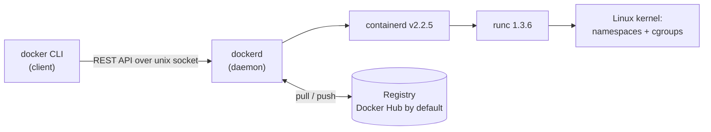
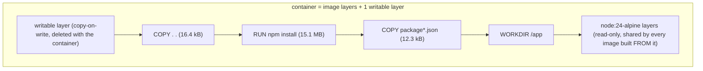
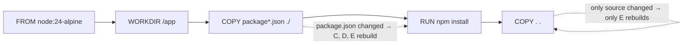

# 03-docker · 1. Concepts from first principles

Source in `course/`: `session6-7-docker/` @ `fe23e99`. Everything below was run on Docker Engine 29.7.2 (Docker Desktop, macOS arm64); see `04-sources.md` for versions and URLs. Claims I could not check against an official page are marked **UNVERIFIED**.

## 1.1 The problem

An application needs a runtime, libraries, config and a filesystem layout. Two apps on one host can need conflicting versions. The two classic answers:

- **Install on the host** and manage conflicts by hand.
- **One virtual machine per app**: full guest OS per app, minutes to boot, GBs of disk. (Comparison table: course PDF `docker-interview-qa.pdf` Q1; the numbers there are the PDF's own claims, not measured here.)

A container is a third answer: **an ordinary Linux process (or process tree) that the kernel has been told to show a private view of the system, and to limit.** No guest kernel. Docker packages and automates that.

Docker docs: "Docker uses a technology called `namespaces` to provide the isolated workspace called the container. ... Each aspect of a container runs in a separate namespace and its access is limited to that namespace." (https://docs.docker.com/get-started/docker-overview/)

## 1.2 Two kernel features do the work

### Namespaces: what a process can *see*

man7 `namespaces(7)`: "A namespace wraps a global system resource in an abstraction that makes it appear to the processes within the namespace that they have their own isolated instance of the global resource." (https://man7.org/linux/man-pages/man7/namespaces.7.html)

| Namespace | Isolates | Where you saw it in Lab 1 |
|---|---|---|
| PID | process IDs | the container's first process was PID 1; `ps` showed 2 processes |
| UTS | hostname | container hostname was its ID; with `--uts=host` it printed `docker-desktop` |
| Mount | mount points | the container has its own root filesystem (the image) |
| Network | devices, stacks, ports | own interface and IP; why you must publish ports (Lab 3) |
| IPC | System V IPC, POSIX queues | listed in `/proc/self/ns` |
| User | user and group IDs | *shared* with the VM by default: container and the VM's PID 1 both show `user:[4026531837]` (read with `docker run --privileged --pid=host`, because an unprivileged container gets `Permission denied` on `/proc/1/ns/*`), while their `pid` and `uts` inodes differ. So root in the container is root in the VM's user namespace |
| Cgroup | cgroup root directory | `cat /proc/self/cgroup` printed `0::/`, i.e. the container sees its own cgroup as root |
| Time | boot and monotonic clocks | listed |

You can see the namespaces of any process in `/proc/<pid>/ns/`. Each symlink target such as `pid:[4026532557]` is an identity: two processes with the same number share that namespace.

### Cgroups: what a process can *use*

man7 `cgroups(7)`: control groups are "a Linux kernel feature which allow processes to be organized into hierarchical groups whose usage of various types of resources can then be limited and monitored." (https://man7.org/linux/man-pages/man7/cgroups.7.html) cgroups v2 (Linux 4.5+) puts all controllers in one unified hierarchy; this VM uses v2 (`docker info` → `cgroup 2`).

Docker's `--memory` and `--cpus` write into cgroup files. Lab 1 shows it: `--memory 64m` → `/sys/fs/cgroup/memory.max` = `67108864` (64 × 1024 × 1024); `--cpus 0.5` → `cpu.max` = `50000 100000` (50 000 µs of CPU per 100 000 µs period). Docker's own statement: limits are enforced through cgroups, and when a container exceeds `--memory` "the kernel's Out of Memory (OOM) killer terminates processes within that container" (https://docs.docker.com/engine/containers/resource_constraints/).

### On a Mac there is a Linux VM in the middle

Docker Desktop "runs the Docker Engine inside a lightweight Linux virtual machine (VM)" (https://docs.docker.com/desktop/features/networking/). macOS has neither namespaces nor cgroups. Consequences you can observe:

- `docker run --pid=host alpine ps` lists **166 processes starting with `/initd` and `[kthreadd]`**: that is the VM, not your Mac.
- `--uts=host` prints `docker-desktop`; kernel is `7.0.12-linuxkit` (`docker info`).
- Course Linux commands (`ip`, `ss`, `systemctl`) run *inside containers*, never on macOS.

## 1.3 Architecture

- Docs: "The Docker client talks to the Docker daemon, which does the heavy lifting of building, running, and distributing your Docker containers." They "communicate using a REST API, over UNIX sockets or a network interface." A registry stores images; "Docker looks for images on Docker Hub by default." (https://docs.docker.com/get-started/docker-overview/)
- Failure you saw at the start of this session: `docker version` printed the client version but `failed to connect to the docker API at unix:///Users/mrind3v/.docker/run/docker.sock` because Docker Desktop was not running. The CLI is only a client.
- The containerd/runc split (containerd = high-level runtime, runc = low-level runtime that creates the container) is stated in the course PDF (Q2). **UNVERIFIED against docs.docker.com**; the versions (`containerd v2.2.5`, `runc 1.3.6`) are from `docker version` on this machine.

## 1.4 Images, layers, containers

- "An image is a read-only template with instructions for creating a Docker container." "A container is a runnable instance of an image." (docker-overview)
- Layers: "Each layer represents an instruction in the image's Dockerfile. Each layer except the very last one is read-only." Only instructions that change the filesystem create layers; metadata-only instructions such as `LABEL` and `CMD` do not. (https://docs.docker.com/engine/storage/drivers/)
- A running container gets "a thin writable layer" on top; writes go there via **copy-on-write**; "When the container is deleted, the writable layer is also deleted. The underlying image remains unchanged." Shared layers "are only stored once".
- You saw this in Lab 5: I overwrote `index.html` inside a running nginx container, `docker rm -f`, re-ran the image, and the original page was back.

The sizes in that diagram are from `docker history d03-node:v1` in Lab 2.

**Image store on this machine.** Docker docs: the containerd image store "is the default storage backend for Docker Engine 29.0 and later on fresh installations" and "stores images in both compressed and uncompressed formats" (https://docs.docker.com/engine/storage/containerd/). `docker info` here shows `overlayfs` and `[[driver-type io.containerd.snapshotter.v1]]`, so older tutorials that say "overlay2" describe the classic store. Behavior difference to expect: a build that pulls a base image by digest does not necessarily leave a tagged `node:24-alpine` in `docker image ls` (I saw `docker image inspect nginx:latest` fail with "No such image" right after a build that used it).

## 1.5 Dockerfile: what each instruction does

All quotes from https://docs.docker.com/reference/dockerfile/ unless stated. Defaults matter because the course leaves many unset.

| Instruction | What it does | Default / if omitted | Gotcha |
|---|---|---|---|
| `FROM image[:tag]` | starts a build stage on a base image | tag omitted → `latest` | must be first (ARG may precede). "Each `FROM` instruction clears any state created by previous instructions" |
| `WORKDIR /app` | working dir for later `RUN/CMD/ENTRYPOINT/COPY/ADD` | default `/` | "If the `WORKDIR` doesn't exist, it will be created" (as root: see Lab 8) |
| `COPY src dest` | copies from the build context (or `--from` a stage/image) | | without trailing `/` on dest, dest is a *filename* |
| `RUN cmd` | executes at **build** time, commits result as a layer | shell form runs `/bin/sh -c` | exec form `["a","b"]` does no shell processing (no `$VAR`) |
| `EXPOSE 3000` | documents the container's listening port | protocol TCP | "doesn't actually publish the port. It functions as a type of documentation" |
| `CMD [...]` | default command at container start | only the last `CMD` counts | overridden by args after the image in `docker run` |
| `ENTRYPOINT [...]` | makes the container behave like an executable | | shell form "ignores any `CMD` or `docker run` command line arguments" and "does not pass signals" |
| `ENV k=v` | env var in build *and* runtime | | persists in the final image |
| `ARG k[=v]` | build-time-only variable (`--build-arg`) | | not for secrets ("visible in docker history") |
| `USER u` | user for later `RUN/CMD/ENTRYPOINT` in this stage | root if never set | affects only *later* instructions (Lab 8) |
| `HEALTHCHECK CMD ...` | command Docker runs to mark the container healthy/unhealthy | `--interval=30s --timeout=30s --start-period=0s --start-interval=5s --retries=3` | exit `0` healthy, `1` unhealthy, `2` reserved; only the last one counts |

**CMD + ENTRYPOINT together** (exec forms): the final command is `ENTRYPOINT` args followed by `CMD` args; `CMD` is the overridable default. Observed: the `nginx` base image has `entrypoint=["/docker-entrypoint.sh"] cmd=["nginx","-g","daemon off;"]` (Lab 5), which is exactly why the course's `CMD ["nginx", "-g", "daemon off;"]` is a no-op copy of the base image's default.

**Shell vs exec form** matters for PID 1, next section.

## 1.6 Why PID 1 matters: `docker stop`

`docker stop`: "The main process inside the container will receive `SIGTERM`, and after a grace period, `SIGKILL`." Default grace period 10 s on Linux containers ("as determined by the Docker daemon if no custom default is configured"). (https://docs.docker.com/reference/cli/docker/container/stop/)

Kernel rule (man7 `pid_namespaces(7)`): "Only signals for which the 'init' process has established a signal handler can be sent to the 'init' process by other members of the PID namespace" and SIGKILL/SIGSTOP from an ancestor namespace are "forcibly delivered". So the first process in a container (PID 1) is *not* killed by SIGTERM unless it installed a handler. (https://man7.org/linux/man-pages/man7/pid_namespaces.7.html)

What I measured (Lab 3G, node app, same code, only the way it is launched differs):

| Launch | `docker stop` took | Exit code | Reading |
|---|---|---|---|
| `CMD ["npm","start"]` (course) | 0.64 s | 1 | npm is PID 1 and node its child (`docker top` PPID chain); it exited quickly, but with status 1, not a clean 0 |
| `CMD ["node","server.js"]` | 3.1 s | **137** | node as PID 1 had no SIGTERM handler → waited out the grace period → SIGKILL |
| same + `docker run --init` | 0.11 s | 143 | `--init` = "Run an init inside the container that forwards signals and reaps processes" |

Exit code = 128 + signal number (bash man page: "When a command terminates on a fatal signal N, bash uses the value of 128+N"): 137 = 128+9 SIGKILL, 143 = 128+15 SIGTERM. (Docker reports the same convention; that Docker *reuses* it is what the numbers above show, not something I found a doc sentence for.)

**Oddity, UNVERIFIED cause:** the docs say 10 s, I measured about 3 s (`--stop-timeout 1` → 1.1 s). `StopTimeout` on the container was `<nil>`, so the shortened grace period comes from the Docker Desktop daemon configuration, which I did not inspect.

## 1.7 Build cache

Docker: "once a layer changes, then all downstream layers need to be rebuilt as well"; place things that change often (source code) after things that change rarely (dependency install). (https://docs.docker.com/build/cache/)

Measured in Lab 2 with the course's `node-app/Dockerfile`: no change → every step `CACHED`; edit `server.js` → only `COPY . .` re-ran; edit `package.json` → `COPY package*.json` + `npm install` + `COPY . .` re-ran. Swap the order (`COPY . .` before `RUN npm install`) and every source edit re-ran `npm install` (Lab 2 break). The course's own `node-app` ordering is already the good one; the lesson is *why*.

**Build context and `.dockerignore`.** "The build context is the set of files that your build can access"; the client looks for `.dockerignore` "in the root directory of the context", newline-separated patterns, `!` negates, last matching rule wins. (https://docs.docker.com/build/concepts/context/) The course has no `.dockerignore`, so `COPY . .` sends and copies everything in the folder, including a local `node_modules` if you ran `npm install` on the host. Not run in a lab; **UNVERIFIED by experiment**.

## 1.8 Multi-stage builds

"You can selectively copy artifacts from one stage to another, leaving behind everything you don't want in the final image." Syntax: `FROM base AS name` … `COPY --from=name /path /dest`; `docker build --target name` stops at a stage; BuildKit "only builds the stages that the target stage depends on". (https://docs.docker.com/build/building/multi-stage/)

The point is to leave the **build tools** behind. Two measured cases (Lab 4):

| Case | Image | Content size |
|---|---|---|
| course `multi-stage-dockerfile` builder stage | `--target builder` | 64,913,032 B |
| course `multi-stage-dockerfile` final stage | default | 63,999,186 B (**0.9 MB smaller**) |
| C program, one stage with `gcc` | `Dockerfile.single` | 241 MB |
| same program, `FROM scratch` + `COPY --from=builder` | `Dockerfile.multi` | **176 kB** |

The course's builder stage runs `npm install` and copies files; the final stage runs `npm install --omit=dev` again. Nothing is *built* in stage 1, so nothing is left behind and the result is barely smaller. Multi-stage pays off when stage 1 compiles or bundles (the C example, or `npm run build`). Trade-off shown in Lab 4: the `scratch` image has no shell (`exec: "/bin/sh": stat /bin/sh: no such file or directory`), so you cannot `docker exec` into it.

## 1.9 Running containers: the flags the course uses

Defaults from https://docs.docker.com/reference/cli/docker/container/run/.

| Flag | Meaning | Omitted |
|---|---|---|
| `-d` | "Run container in background and print container ID" | foreground, tied to your terminal |
| `-p host:container` | "Publish a container's port(s) to the host" | nothing is reachable from the host (Lab 3A) |
| `-P` | "Publish all exposed ports to random ports" (uses `EXPOSE`; got `0.0.0.0:55000`) | |
| `-p 127.0.0.1:h:c` | only the Docker host can reach it | binds to all interfaces (`0.0.0.0` and `[::]`) |
| `--name` | "Assign a name to the container" | Docker generates a name (pattern not checked against docs) |
| `-i` / `-t` | keep STDIN open / allocate a TTY (`-it` for a shell) | |
| `--rm` | remove container (and its anonymous volumes) on exit | stays in `docker ps -a` |
| `-e K=V` | env var | |
| `--restart` | restart policy | `no` |
| `--memory` / `--cpus` | cgroup limits | unlimited (`memory.max` = `max`) |
| `--read-only` | root filesystem read-only | writable |
| `--init` | run a tiny init as PID 1 | your process is PID 1 |

Port publishing: "By default, for both IPv4 and IPv6, the Docker daemon blocks access to ports that have not been published." (https://docs.docker.com/engine/network/port-publishing/) Lab 3A/3D shows the two ways it goes wrong: container port not published → `Failed to connect ... Couldn't connect to server`; published to the wrong container port (`-p 3001:80` while the app listens on 3000) → `Connection reset by peer`.

## 1.10 Compose

Compose describes several containers in one YAML file. Two CLIs exist: `docker-compose` (v1) and `docker compose` (v2); "supported Docker Compose CLI versions are Compose v2 and Compose v5" (https://docs.docker.com/compose/intro/history/). This machine has Compose **v5.4.0**, and `/usr/local/bin/docker-compose` is a symlink into Docker Desktop's CLI plugin, so both spellings run the same binary here. Whether v1 is end-of-life: **UNVERIFIED** (the page I fetched gave no date).

- Top-level `version:` is obsolete: "It is only informative and you'll receive a warning message that it is obsolete if used." (https://docs.docker.com/reference/compose-file/version-and-name/). Observed: ``the attribute `version` is obsolete, it will be ignored``. The course's compose file correctly has no `version:`; the interview PDF's examples all have `version: '3.8'`.
- `depends_on`: "Compose does not wait until a container is 'ready', only until it's running." Use `condition: service_healthy` with a `healthcheck` to wait for readiness. (https://docs.docker.com/compose/how-tos/startup-order/) Lab 7C measured both: short syntax → client got `refused`; `service_healthy` → `Healthy` then `connected`.
- Default network: Compose created `d03compose_default` (bridge) and containers reach each other by service name (`getent hosts redis` → `172.18.0.2`). Networks and volumes in depth are topic 04.

## 1.11 Cleanup commands and their blast radius

`docker system prune` removes "all unused containers, networks, images (both dangling and unused), unused build cache"; `-a` adds all unused images, `--volumes` adds unused anonymous volumes; it asks `Are you sure you want to continue? [y/N]` unless `-f`. (https://docs.docker.com/reference/cli/docker/system/prune/) There is no dry-run flag, so I did not run it.

`docker rm -f $(docker ps -aq)` and `docker rmi -f $(docker images -q)` (course `docker.md`, `docker-advance-cmd.pdf`) act on **every** container/image on the daemon. On this machine, `docker ps -a` before the labs contained a `minikube` container and `docker images` contained `gcr.io/k8s-minikube/kicbase:v0.0.50`; those two commands would have deleted your minikube cluster node and its base image. The labs here label everything (`--label lab=03-docker`) and name it `d03-*`, and clean up by that label. Habit to keep: **scope cleanup with `--filter label=...` or names, never `$(docker ps -aq)`.**

## 1.12 Best practices worth knowing (from the official guide)

From https://docs.docker.com/build/building/best-practices/:
- **Pin base images.** Tags move; digests do not: "By pinning your images to a digest, you're guaranteed to always use the same image version, even if a publisher replaces the tag with a new image." The course uses `nginx:latest` (resolved during my build to `nginx/1.31.6` on Debian 13, digest `sha256:abe47724…`) and floating tags such as `redis:alpine` and `nginx:alpine`.
- **Non-root.** "If a service can run without privileges, use `USER` to change to a non-root user." (Lab 8: order matters.)
- **`RUN apt-get update` and `apt-get install` in one `RUN`**, else cached `update` goes stale.
- **Exec-form `CMD`**: "`CMD` should almost always be used in the form of `CMD ["executable", "param1", "param2"]`."
- Order for cache, `.dockerignore`, multi-stage (above).
